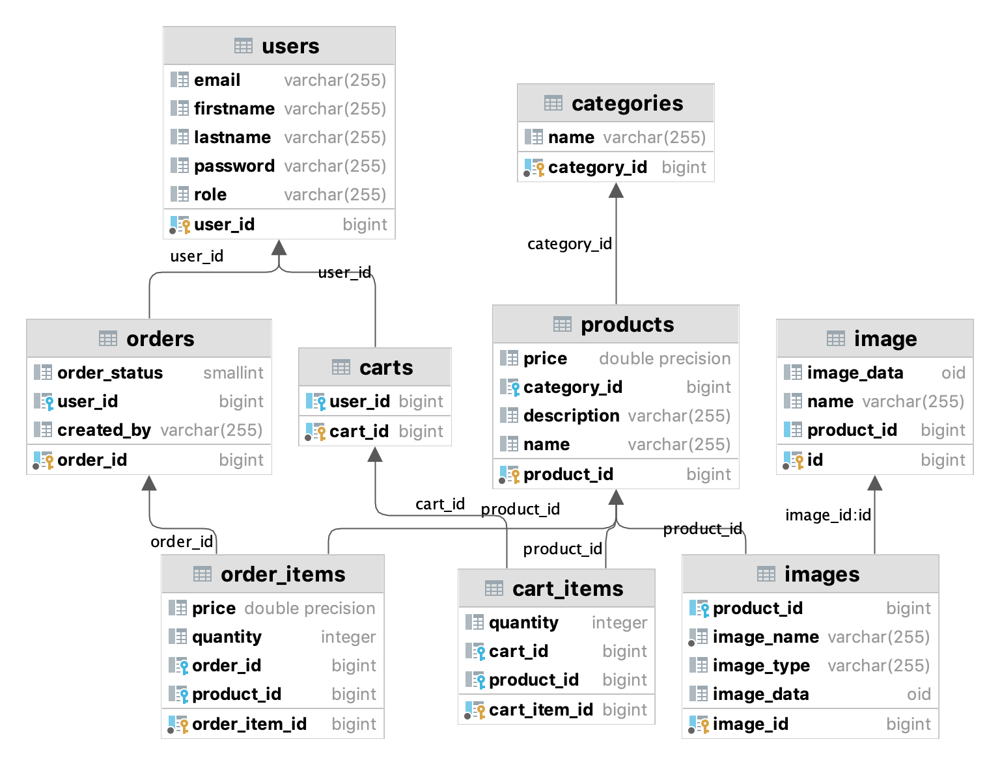

# _Restaurant Service Application_
# Table of Contents
1. [Restaurant Service Application](#restaurant-service-application)
    - [Overview](#overview)
    - [Technologies Used](#technologies-used)
    - [API Documentation](#api-documentation)
2. [Tests for Restaurant-Application](#tests-for-restaurant-application)
    - [Service Tests](#service-tests)
        - [CategoryServiceTests](#categoryservicetests)
        - [ImageServiceTests](#imageservicetests)
        - [ProductServiceTests](#productservicetests)
        - [OrderServiceTests](#orderservicetests)
    - [Controller Tests](#controller-tests)
        - [CategoryControllerTests](#categorycontrollertests)
        - [ImageControllerTests](#imagecontrollertests)
        - [ProductControllerTests](#productcontrollertests)
        - [OrderControllerTests](#ordercontrollertests)
3. [Database Schema Illustration](#database-schema-illustration)
    - [Liquibase Database ChangeLog](#liquibase-database-changelog)
        - [ChangeLog Structure](#changelog-structure)
        - [Changesets](#changesets)
4. [Security Configuration](#security-configuration)
    - [Configuration Overview](#configuration-overview)
    - [SecurityFilterChain Configuration](#securityfilterchain-configuration)
    - [Access Roles](#access-roles)
    - [Note](#note)
5. [JWT Service Documentation](#jwt-service-documentation)
    - [Overview](#overview-1)
    - [Key Components](#key-components)
    - [Token Structure](#token-structure)
    - [Note](#note-1)
6. [JwtAuthenticationFilter Documentation](#jwtauthenticationfilter-documentation)
    - [Overview](#overview-2)
    - [Key Components](#key-components-1)
    - [Request Header](#request-header)
    - [Authentication Process](#authentication-process)
    - [Note](#note-2)


## Overview
The **Restaurant Service** is backend application developed using _**Spring Boot**_, providing essential functionality for comprehensive **_restaurant management_**. This service is structured into multiple components, each dedicated to specific aspects of the restaurant business.

## Technologies Used
- **Spring Boot**: 
Framework for Java-based application development with a focus on convention over
configuration.

- **Spring Data JPA**: Part of the Spring Data project, providing convenient abstractions for working
with databases using JPA (Java Persistence API).

- **PostgreSQL Driver**: Driver enabling communication with the PostgreSQL database.

- **Spring Web**: A module in the Spring framework that facilitates the development of web applications.

- **Project Lombok**: A library simplifying Java development by automatically generating methods
such as getters, setters, and constructors.

- **Spring Boot Starter Test**: Dependency set for testing Spring Boot applications.

- **JUnit Jupiter**: Java framework for writing tests.

- **MapStruct**: Framework for mapping Java objects between different layers of an application.

- **Spring Boot Starter Security**: Starter for incorporating security features into Spring Boot
- applications.

- **JWT (JSON Web Token):** Library for working with JSON Web Tokens.

- **Liquibase**: Tool for managing database schema evolution.

- **Java 17**: Version of the Java programming language used in the project.

## API Documentation:
_**Each** service **include** his own **API** documentation._

1. **[Order-service](docs/api/order-service.md)**: This service handles the ordering process, allowing users to place and manage their orders efficiently.

2. **[Product-service](docs/api/product-service.md)**: In the product-service, users can create and edit various food and beverage items offered by the restaurant.

3. **[Category-service](docs/api/category-service.md)**: The category-service is responsible for managing product categories, enabling the creation and editing of different food and drink categories.

4. **[Image-service](docs/api/image-service.md)**: This service plays a crucial role in handling file transformations. It manages the conversion of files for storage in the database or delivery to end-users, enhancing the overall user experience.

5. **[Cart-service](docs/api/cart-service.md)**: The cart-service is dedicated to managing the shopping cart functionality, providing users with a seamless experience for adding, removing, and reviewing items in their cart.


## Tests for Restaurant-Application

## Service Tests

### [CategoryServiceTests](docs/tests/service/category-service-tests.md)

The `CategoryServiceTests` cover various scenarios related to the `CategoryService` implementation. These scenarios include:

- Retrieving a category by ID.
- Handling scenarios where the requested category is not found or encounters an exception.
- Retrieving products by category ID.
- Retrieving all categories.
- Creating a new category and handling exceptions during the creation process.
- Updating a category and handling scenarios where the category is not found.
- Deleting a category and handling scenarios where the category is not found.

### [ImageServiceTests](docs/tests/service/image-service-tests.md)

The `ImageServiceTests` focus on the `ImageService` functionality. The tests include:

- Uploading a valid image file.
- Handling scenarios where an empty file is provided.
- Retrieving an image by its name and handling scenarios where the image is not found.

### [ProductServiceTests](docs/tests/service/product-service-tests.md)

The `ProductServiceTests` cover different aspects of the `ProductService`. These include:

- Retrieving a product by ID and handling scenarios where the product is not found.
- Retrieving all products and handling exceptions during the process.
- Creating a new product and handling exceptions during creation.
- Updating a product, including scenarios where the product is not found.
- Deleting a product and handling scenarios where the product is not found.

### [OrderServiceTests](docs/tests/service/order-service-tests.md)

The `OrderServiceTests` focus on testing the `OrderService`. Key scenarios covered include:

- Creating a new order and handling scenarios with a null order DTO.
- Retrieving all orders and transforming order entities into DTOs.
- Retrieving an order by ID, handling scenarios with both existing and non-existing order IDs.
- Updating an order and handling scenarios with both existing and non-existing order IDs.
- Updating the order status and handling scenarios with both existing and non-existing order IDs.
- Deleting an order and handling scenarios where the order exists or does not exist.
- Checking if an order is owned by a user and handling scenarios with both existing and non-existing order IDs.

## Controller Tests

### [CategoryControllerTests](docs/tests/controller/category-controller-tests.md)

### Overview
Tests for `CategoryController`, managing category-related operations.

### Test Cases
- **getAllCategories:** Retrieve a list of all categories.
- **getCategoryById:** Get details of a specific category by ID.
- **getProductsByCategoryId:** Retrieve products belonging to a specific category.
- **createCategory:** Create a new category.
- **updateCategory:** Update details of an existing category.
- **deleteCategory:** Delete an existing category.

### [ImageControllerTests](docs/tests/controller/image-controller-tests.md)

### Overview
Tests for `ImageController`, responsible for image-related operations.

### Test Cases
- **testUploadImage:** Upload a valid image file.
- **testUploadImage_InvalidFileType:** Attempt to upload an invalid file type.
- **testUploadImage_ServiceFails:** Simulate a failure scenario during image upload.
- **testDownloadImage_ExistingFileName:** Download the content of an existing image file.

### [ProductControllerTests](docs/tests/controller/product-controller-tests.md)

### Overview
Tests for `ProductController`, handling product-related API endpoints.

### Test Cases
- **getAllProducts:** Retrieve a list of all products.
- **getProduct:** Get details of a specific product by ID.
- **createProduct:** Create a new product.
- **updateProduct:** Update details of an existing product.
- **deleteProduct:** Delete an existing product.

### [OrderControllerTests](docs/tests/controller/order-controller-tests.md)

### Overview
Tests for `OrderController`, managing order-related operations.

### Test Cases
- **getAllOrders:** Retrieve a list of all orders.
- **getOrderById:** Get details of a specific order by ID.
- **createOrder:** Create a new order.
- **updateOrderStatus:** Update the status of an existing order.
- **updateOrder:** Update details of an existing order.
- **deleteOrder:** Delete an existing order.


# Database Schema Illustration



## Liquibase Database ChangeLog

This project utilizes Liquibase for database schema management. Liquibase is an open-source tool that allows you to version control your database schema and automate database changes.

### ChangeLog Structure

The `databaseChangeLog` file serves as the main entry point for managing database changes. It includes references to individual changesets, each encapsulating a set of changes to the database schema.

```yaml
databaseChangeLog:
  - include:
      file: db/changelog/changeset/create-user-table.yaml
  - include:
      file: db/changelog/changeset/create-cart-table.yaml
  - include:
      file: db/changelog/changeset/create-categories-table.yaml
  - include:
      file: db/changelog/changeset/create-orders-table.yaml
  - include:
      file: db/changelog/changeset/create-cart-items-table.yaml
  - include:
      file: db/changelog/changeset/create-images-table.yaml
  - include:
      file: db/changelog/changeset/create-products-table.yaml
```
## Changesets

Each changeset file (`create-user-table.yaml`, `create-cart-table.yaml`, etc.) defines specific modifications to the database schema. Liquibase automatically applies these changes in a version-controlled and systematic manner.

# Security Configuration

The `SecurityConfig` class in the `com.example.restaurantservice.config` package manages the security configuration for the Restaurant Service. It utilizes Spring Security to define access rules, authentication providers, and filters.

## Configuration Overview

- **JwtAuthenticationFilter**: This filter handles the authentication process using JSON Web Tokens (JWT).
- **AuthenticationProvider**: Responsible for authenticating users based on the provided credentials.

## SecurityFilterChain Configuration

The `securityFilterChain` method configures the security filters for various endpoints and HTTP methods. Key configurations include:

- **CSRF Protection**: CSRF protection is disabled for this service.

- **Authorization Rules**:
   - Open access to endpoints under "/api/v1/auth/**" for all.
   - **ProductService**:
      - Allow POST, PUT, DELETE operations for "/api/v1/product/**" only for users with the role "ADMIN."
   - **CategoryController**:
      - Allow POST, PUT, DELETE operations for "/api/v1/category/**" only for users with the role "ADMIN."
   - **OrderService**:
      - Allow POST, PUT, DELETE operations for "/api/v1/order/**" only for users with the appropriate roles.
   - **CartController**:
      - Allow POST, PUT, DELETE operations for "/api/v1/cart/**" only for users with the appropriate roles.
   - **ImageController**:
      - Allow POST operation for "/api/v1/image/upload" only for users with the role "ADMIN."

- **Session Management**:
   - Stateless session management to ensure that the service does not store session state.

- **Authentication Provider**:
   - Specifies the authentication provider used for user authentication.

- **JwtAuthenticationFilter Placement**:
   - Adds the custom JwtAuthenticationFilter before the default UsernamePasswordAuthenticationFilter in the filter chain.

## Access Roles

- **ADMIN**: Users with administrative privileges.
- **USER**: Regular users.

## Note

This configuration enhances the security of the Restaurant Service by enforcing access control and authentication based on user roles and employing JWT for secure communication. Adjustments to the rules can be made according to specific application requirements.


## JWT Service Documentation

The `JwtService` class in the `com.example.restaurantservice.config` package provides functionality for JSON Web Token (JWT) generation, validation, and extraction. This service is a crucial component of the authentication mechanism in the Restaurant Service.

## Overview

The `JwtService` class is responsible for handling JWT-related operations, including token generation, extraction, and validation.

## Key Components

### Secret Key

The `SECRET_KEY` field contains the secret key used for signing and validating JWTs. In this implementation, it is a static string, but in a production environment, it should be securely stored.

### Methods

#### `extractUsername(String token)`

Extracts the username from a given JWT token.

#### `extractClaim(String token, Function<Claims, T> claimResolver)`

Extracts claims from a JWT token using the provided `claimResolver` function.

#### `generateToken(UserDetails userDetails)`

Generates a JWT token for the specified `UserDetails` object.

#### `generateToken(Map<String, Object> extraClaims, UserDetails userDetails)`

Generates a JWT token with additional claims for the specified `UserDetails` object.

#### `isTokenValid(String token, UserDetails userDetails)`

Checks if a JWT token is valid for the given `UserDetails`.

#### `getSignInKey()`

Gets the signing key used for JWT operations.

### Token Structure

JWTs generated by this service include claims such as subject, expiration, issued at, and additional custom claims.

## Note

This service is a crucial part of the security infrastructure in the Restaurant Service, ensuring secure user authentication and authorization.

## JwtAuthenticationFilter Documentation

The `JwtAuthenticationFilter` class in the `com.example.restaurantservice.config` package is an implementation of the Spring `OncePerRequestFilter` used for processing JWT (JSON Web Token) authentication in the Restaurant Service.

## Overview

This filter intercepts incoming HTTP requests and performs JWT-based authentication by checking the validity of the provided token. If a valid token is present, it authenticates the user and sets the authentication details in the `SecurityContextHolder`.

## Key Components

### Fields

- `jwtService`: An instance of the `JwtService` responsible for JWT-related operations.
- `userDetailsService`: An instance of the Spring `UserDetailsService` used to load user details from the database.

### Methods

#### `doFilterInternal(HttpServletRequest request, HttpServletResponse response, FilterChain filterChain)`

The main method that handles the filtering of incoming requests. It extracts the JWT from the request header, validates it, and authenticates the user.

## Request Header

The filter expects the JWT to be present in the "Authorization" header, following the "Bearer " scheme.

## Authentication Process

1. **Token Validation Check**: Validates the format of the Authorization header and extracts the JWT.
2. **User Check**: Checks if the user is not already authenticated and if a user with the extracted email exists in the database.
3. **Token Validity Check**: Validates the extracted JWT against the user details loaded from the database.
4. **Authentication**: If the token is valid, creates an `UsernamePasswordAuthenticationToken` and sets it in the `SecurityContextHolder`.

## Note

This filter plays a crucial role in authenticating and securing the Restaurant Service by ensuring that only valid users with a correctly formatted JWT gain access to protected endpoints.


## Summary
In summary, the Restaurant Service Application offers a comprehensive solution for restaurant management, leveraging modern technologies and best practices to provide a secure, efficient, and user-friendly experience for both administrators and customers.